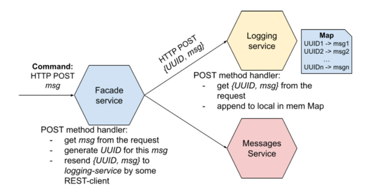
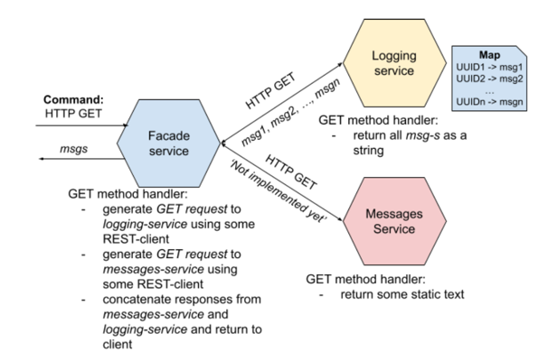

# **Lab 01: Basic   Architecture of Microservices**

**Author: Yaroslav Prytula**

----

##### Table of Content
- [Requirement](#requirement)
- [Idea](#idea)
  - [POST Flow](#post_flow)
  - [GET Flow](#get_flow)
- [Usage](#usage)
  - [Run](#run)
  - [Requests](#requests)
- [Results](#results)


----

<a name="requirement"></a>
## **Requirement**


Before starting to work with current repository please make sure to download it locally on your machine

```bash
git clone https://github.com/SlavkoPrytula/microservices_architecture/
git fetch
git checkout micro_basics
```

Install the requirements

```bash
pip install -r requirements.txt
```

---- 

## **Idea**

<a name="post_flow"></a>
#### **POST Flow**
The client sends a **POST** request to the facade-service, with a specific text message - **msg**
- upon receiving the message, facade-service generates a unique **UUID** for it

The **{UUID, msg}** pair is sent to the logging service using the REST/HTTP client software as a POST message
- logging-service receives the message, saves it and the ID in the local hash table (ID - as a key) and displays the received message in its console



<a name="get_flow"></a>
#### **GET Flow**

The client sends a **GET** request for facade-service
- upon receipt of the request facade-service generates GET-requests to logging-service and messages-service using software REST/HTTP-client
- logging-service upon receipt returns all messages (without keys) stored in the hash table in the form of a string
- messages-service returns static text upon request, such as ‘not implemented yet’
- facade-service, having received answers from logging-service and messages-service, concatenates the text of both answers and returns it to the client



----

<a name="usage"></a>
## **Usage**

<a name="run"></a>
#### Run 

```bash
python facade-service/facade_main.py
python logging-service/logging_main.py
python messages-service/messages_main.py
```

<a name="requests"></a>
#### Requests

In the main folder directory file `requests.http` stores the needed request commands `(POST/GET)`
You can also use Postman tool, curl...

----

<a name="results"></a>
## **Results**

For fully detailed usage and results please refer to the `Lab_01.pdf` file


