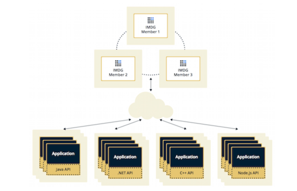

# **Lab 02: Hazelcast Basics**

**Author: Yaroslav Prytula**

----

##### Table of Content
- [Requirement](#requirement)
- [Idea](#idea)
  - [Hazelcast](#hazelcast)
- [Usage](#usage)
  - [Start Hazelcast](#start_hazelcast)
  - [Run](#run)
- [Results](#results)


----

<a name="requirement"></a>
## **Requirement**


Before starting to work with current repository please make sure to download it locally on your machine

```bash
git clone https://github.com/SlavkoPrytula/microservices_architecture/
git fetch
git checkout hazelcast_practice
```

Install the requirements

```bash
pip install -r requirements.txt
```

---- 

## **Idea**

<a name="hazelcast"></a>
#### **Hazelcast**

Hazelcast is a **distributed repository of data in RAM**. 
- "Distributed" means that each node (server) of the system runs its own instance of Hazelcast, which are then combined into a common cluster.
- Within this cluster, through the API you can create various distributed data structures: **Map, Queue, Topic, Lock, ...**



----

<a name="usage"></a>
## **Usage**

<a name="start_hazelcast"></a>
#### Start Hazelcast 

For more information and further tutorial refer to the [original page](https://hazelcast.org/imdg/get-started/)

Start Hazelcast cluster locally

```bash
cd hazelcast-4.2.5/bin
bash start.sh
```

You can also download the hazelcast client locally and start it

```bash
hz-start
```

- This will create one node in the distributed system

<br />

<a name="run"></a>
#### Run 

```bash
cd distributed_map
python distributed_map.py  # distributed map
```

```bash
cd distributed_map_with_locks
python distributed_map_with_locks.py  # distributed map with locks
```

```bash
cd bounded_queue
python bounded_queue.py  # bounded queue
```

For viewing th contents of the whole distributed map you can also use the  
```bash
python read_map.py 
```

----

<a name="results"></a>
## **Results**

For fully detailed usage and results please refer to the `Lab_02.pdf` file

