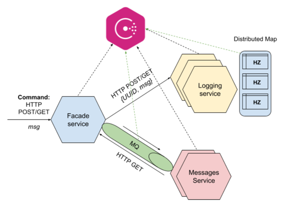

# **Lab 05: Miсroservices with Consul**

**Author: Yaroslav Prytula**

----

##### Table of Content
- [Requirement](#requirement)
- [Idea](#idea)
- [Usage](#usage)
  - [Start Consul](#start_consul)
  - [Start Hazelcast](#start_hazelcast)
  - [Run](#run)
  - [Requests](#requests)
- [Results](#results)
- [References](#references)


----

<a name="requirement"></a>
## **Requirement**


Before starting to work with current repository please make sure to download it locally on your machine

```bash
git clone https://github.com/SlavkoPrytula/microservices_architecture/
git fetch
git checkout micro_consul
```

Install the requirements

```bash
pip install -r requirements.txt
```

---- 

## **Idea**




----

<a name="usage"></a>
## **Usage**

<a name="start_consul"></a>
#### Starting the Consul Agent

Start a Consul agent with the `consul` command and `agent` subcommand using the following syntax

```bash
consul agent <options>
```

Consul ships with a `-dev` flag that configures the agent to run in server mode

```bash
consul agent -dev
```

<br />

<a name="start_hazelcast"></a>
#### Start Hazelcast 

For more information and further tutorial refer to the [original page](https://hazelcast.org/imdg/get-started/)

Start Hazelcast cluster locally

```bash
cd hazelcast-4.2.5/bin
bash start.sh
```

You can also download the hazelcast client locally and start it

```bash
hz-start
```

- This will create one node in the distributed system

<br />

<a name="run"></a>
#### Run 

Facade Service is running locally on the **8080** port
```bash
cd facade-service
python facade_controller.py  # facade_controller
```

```bash
cd logging-service
python logging_controller.py --port [port]  # ex. python logging_controller.py --port 8004
```

Messages Service is running locally on the **8081, 8082** ports
```bash
cd messages-service
python messages_service.py  # messages_service
```

<br />

<a name="requests"></a>
#### Requests

In the main folder directory file `requests.http` stores the needed request commands `(POST/GET)`
You can also use Postman tool, curl...

----

<a name="results"></a>
## **Results**

For fully detailed usage and results please refer to the `Lab_04.pdf` file

----

<a name="references"></a>
## **References**
Good tutorial with code: https://www.consul.io/api-docs/libraries-and-sdks